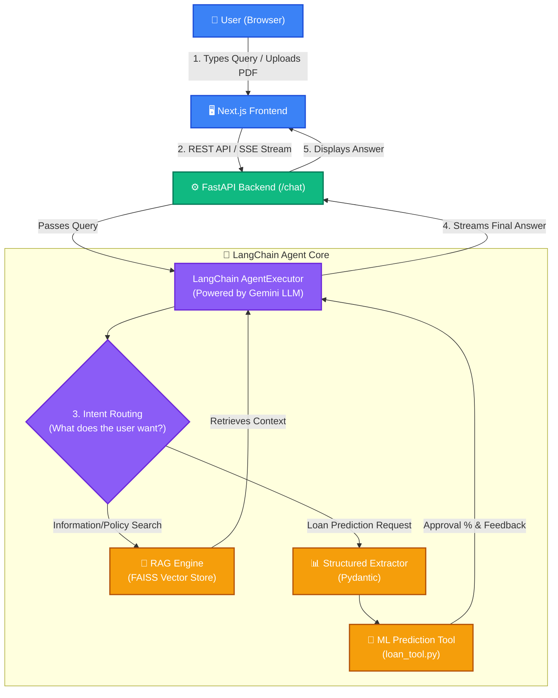
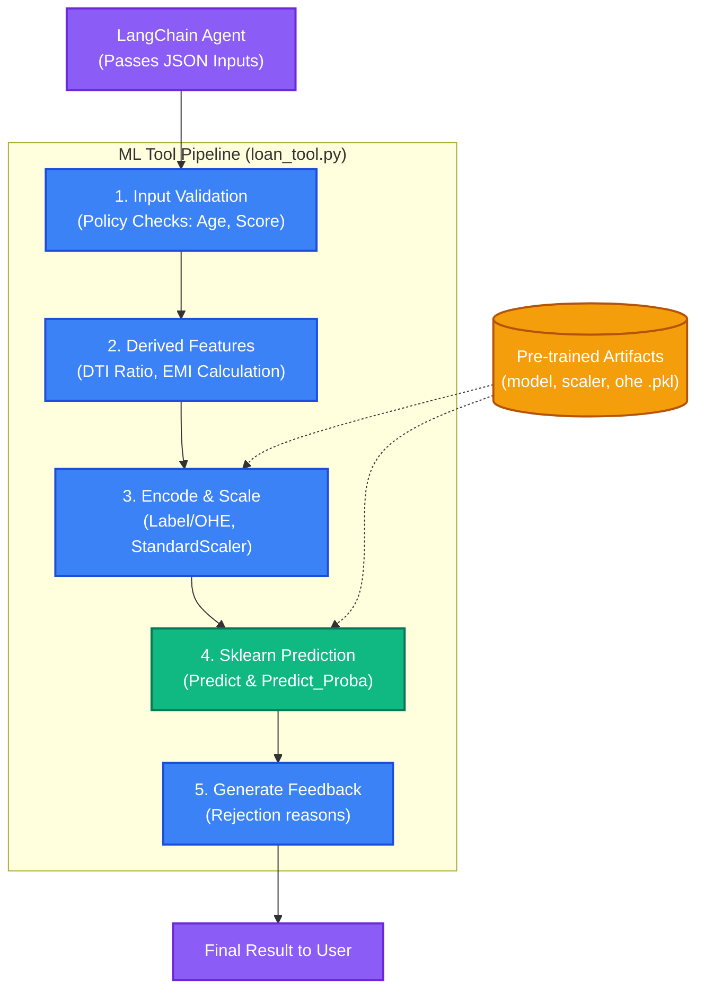

# 🏦 AI Loan Approval System

<div align="center">
  <p><strong>A production-ready, RAG-based AI Loan Approval Agent built with modern, decoupled 3-tier architecture.</strong></p>
  
  
  
  
</div>

<br />

The **AI Loan Approval System** is an intelligent, containerized web application designed to evaluate loan applications, analyze financial documents, and predict loan approvals using Machine Learning and Retrieval-Augmented Generation (RAG). 

Recently refactored from a monolithic app into a decoupled, highly scalable architecture, it features a beautiful React/Next.js frontend, a blazingly fast FastAPI backend, and an intelligent LangChain core.

---

## ✨ Key Features

- 🔐 **JWT Authentication** — Secure login and signup with JSON Web Tokens.
- 🎨 **Modern & Premium UI** — A highly responsive, glassmorphic user interface built with Next.js and Vanilla CSS.
- 📄 **Intelligent Document Parsing** — Upload loan documents (PDFs, TXTs) including policies, credit reports, and income proofs.
- 🧠 **RAG Pipeline** — Automatic document chunking, embeddings generation, and FAISS indexing for accurate semantic search.
- 🤖 **ML & AI Prediction** — Uses advanced LLMs (Google Gemini) and a trained `sklearn` model to predict loan approvals with calculated confidence scores.
- 📊 **Structured Data Extraction** — Enforces JSON structured outputs using Pydantic to cleanly display applicant data on the dashboard.
- 🐳 **Fully Dockerized** — Effortless setup and deployment with Docker Compose.

---

## 🏗 End-to-End Architecture & User Query Flow

The system features a fully decoupled 3-tier architecture. The diagram below illustrates the complete lifecycle of a User Query—how the Next.js Frontend communicates with the FastAPI Backend, and how the **LangChain Agent** dynamically routes the query to either the **RAG Engine** (for document search) or the **ML Tool** (for loan predictions).



### How an End-to-End Query Works:
1. **User Request:** The user types a message in the Next.js chat interface (e.g., *"Based on my uploaded documents, will my loan be approved?"*).
2. **Backend Routing:** The request hits the FastAPI `/chat` endpoint, which authenticates the user via JWT and forwards the query to the LangChain Agent.
3. **Agent Decision (The "Brain"):** The LangChain Agent uses the LLM (Google Gemini) to understand the user's intent.
   - **If the user asks a policy question:** The agent uses the **RAG Engine** to search the FAISS vector database for relevant paragraphs in uploaded bank policies and returns a contextual answer.
   - **If the user asks for a loan prediction:** The agent uses the **Structured Extractor** to pull numbers (income, age, loan amount) from the chat or uploaded PDFs. It then calls the **ML Prediction Tool**.
4. **ML Processing:** The ML tool validates the extracted data, applies encoding/scaling, and uses a pre-trained `sklearn` model to predict approval chances and generate actionable feedback.
5. **Streaming Response:** The LangChain Agent combines the RAG context or ML feedback into a natural, human-readable response and streams it back (word-by-word) to the Frontend via Server-Sent Events (SSE).

---

## 🧠 How the Machine Learning (ML) Part Works

The Machine Learning aspect of this project is decoupled as a LangChain **Tool** (`backend/tools/loan_tool.py`). This allows the AI Agent (Gemini) to dynamically call the ML model whenever a user asks for a loan prediction.

### The ML Workflow Diagram



### Step-by-Step ML Process
1. **Thread-Safe Loading:** Pre-trained `sklearn` artifacts (the model, scaler, and encoders) are loaded into memory once using a thread-lock to ensure performance and prevent memory leaks.
2. **Validation:** The incoming data is validated against basic banking policies (e.g., Age must be 21-65, income cannot be negative).
3. **Feature Engineering:** Derived financial metrics are calculated, such as the estimated Monthly EMI and the Debt-to-Income (DTI) ratio.
4. **Encoding & Scaling:** Categorical variables (Gender, Education, Property Area) are converted to numbers using Label Encoding and One-Hot Encoding. The final feature set is scaled using `StandardScaler`.
5. **Prediction & Feedback:** The `sklearn` model predicts Approval (1) or Rejection (0) and calculates a confidence score. Based on the data, actionable feedback is generated (e.g., "Your Debt-to-Income ratio of 45% exceeds the 43% policy limit").

---

## 📂 Project Structure

```text
loan_approval_agent/
├── backend/                # FastAPI Backend Service
│   ├── main.py             # Entry point
│   ├── routes/             # API Endpoints (auth, chat, documents)
│   ├── services/           # LangChain RAG logic & LLM agents
│   ├── tools/              # ML model and sklearn tools
│   ├── utils/              # Security (JWT) and helpers
│   ├── database/           # SQLite DB connection
│   └── requirements.txt    # Python dependencies
├── frontend/               # Next.js Frontend Service
│   ├── src/app/            # App router pages (Login, Dashboard)
│   ├── src/lib/api.js      # API fetch client
│   └── package.json        # Node.js dependencies
├── .env                    # Environment variables (Backend)
├── docker-compose.yml      # Docker orchestration
└── README.md
```

---

## 🚀 Setup & Running (Using Docker)

The easiest way to run the application is using Docker Compose. This ensures you don't need to install Python or Node.js directly on your host machine.

### 1. Set API Keys
Create or update the `.env` file in the project root folder:
```env
# Add your respective API keys based on your setup
GEMINI_API_KEY=your_google_gemini_api_key_here
NVIDIA_API_KEY=your_nvidia_api_key_here
OPENAI_API_KEY=your_openai_api_key_here
```

### 2. Build and Start Containers
Make sure **Docker Desktop** is running, then execute the following command in the root directory:
```bash
docker compose up --build -d
```

### 3. Access the Application
- **Frontend UI:** [http://localhost:3000](http://localhost:3000)
- **Backend API Docs (Swagger):** [http://localhost:8000/docs](http://localhost:8000/docs)

---

## 🛠 Troubleshooting: "Red Lines" in VS Code

If you open the project in VS Code and see red squiggly lines (e.g., unresolved imports in `frontend/` or `backend/`), **do not worry! There are no actual syntax errors.**

### Why does this happen?
Because the project runs entirely inside Docker, the required local dependencies (`node_modules` for Next.js, and the Python virtual environment for FastAPI) are installed *inside the containers*, not on your host machine. VS Code's local linting tools cannot see them.

### How to fix it (Optional):
If you want IDE autocomplete and linting to work flawlessly on your host machine, you can install the dependencies locally just for the IDE's sake:
1. **Frontend:** Open terminal, `cd frontend`, and run `npm install`.
2. **Backend:** Open terminal, `cd backend`, create a virtual environment `python -m venv venv`, activate it, and run `pip install -r requirements.txt`.

Otherwise, you can safely ignore the red lines, as Docker handles everything successfully during runtime.
