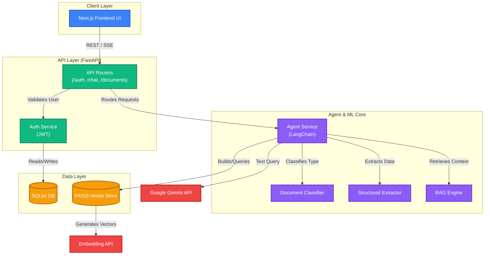

# 🏦 AI Loan Approval System

<div align="center">
  <p><strong>A production-ready, RAG-based AI Loan Approval Agent built with modern, decoupled 3-tier architecture.</strong></p>
  
  
  
  
</div>

<br />

The **AI Loan Approval System** is an intelligent, containerized web application designed to evaluate loan applications, analyze financial documents, and predict loan approvals using Machine Learning and Retrieval-Augmented Generation (RAG). 

Recently refactored from a monolithic app into a decoupled, highly scalable architecture, it features a beautiful React/Next.js frontend, a blazingly fast FastAPI backend, and an intelligent LangChain core.

---

## ✨ Key Features

- 🔐 **JWT Authentication** — Secure login and signup with JSON Web Tokens.
- 🎨 **Modern & Premium UI** — A highly responsive, glassmorphic user interface built with Next.js and Vanilla CSS.
- 📄 **Intelligent Document Parsing** — Upload loan documents (PDFs, TXTs) including policies, credit reports, and income proofs.
- 🧠 **RAG Pipeline** — Automatic document chunking, embeddings generation, and FAISS indexing for accurate semantic search.
- 🤖 **ML & AI Prediction** — Uses advanced LLMs (Google Gemini) and a trained `sklearn` model to predict loan approvals with calculated confidence scores.
- 📊 **Structured Data Extraction** — Enforces JSON structured outputs using Pydantic to cleanly display applicant data on the dashboard.
- 🐳 **Fully Dockerized** — Effortless setup and deployment with Docker Compose.

---

## 🏗 System Architecture

The application is broken down into 5 main components: Frontend, API Layer, Agent Core, Data Layer, and External APIs.



---

## 📂 Project Structure

```text
loan_approval_agent/
├── backend/                # FastAPI Backend Service
│   ├── main.py             # Entry point
│   ├── routes/             # API Endpoints (auth, chat, documents)
│   ├── services/           # LangChain RAG logic & LLM agents
│   ├── tools/              # ML model and sklearn tools
│   ├── utils/              # Security (JWT) and helpers
│   ├── database/           # SQLite DB connection
│   └── requirements.txt    # Python dependencies
├── frontend/               # Next.js Frontend Service
│   ├── src/app/            # App router pages (Login, Dashboard)
│   ├── src/lib/api.js      # API fetch client
│   └── package.json        # Node.js dependencies
├── .env                    # Environment variables (Backend)
├── docker-compose.yml      # Docker orchestration
└── README.md
```

---

## 🚀 Setup & Running (Using Docker)

The easiest way to run the application is using Docker Compose. This ensures you don't need to install Python or Node.js directly on your host machine.

### 1. Set API Keys
Create or update the `.env` file in the project root folder:
```env
# Add your respective API keys based on your setup
GEMINI_API_KEY=your_google_gemini_api_key_here
NVIDIA_API_KEY=your_nvidia_api_key_here
OPENAI_API_KEY=your_openai_api_key_here
```

### 2. Build and Start Containers
Make sure **Docker Desktop** is running, then execute the following command in the root directory:
```bash
docker compose up --build -d
```

### 3. Access the Application
- **Frontend UI:** [http://localhost:3000](http://localhost:3000)
- **Backend API Docs (Swagger):** [http://localhost:8000/docs](http://localhost:8000/docs)

---

## 🛠 Troubleshooting: "Red Lines" in VS Code

If you open the project in VS Code and see red squiggly lines (e.g., unresolved imports in `frontend/` or `backend/`), **do not worry! There are no actual syntax errors.**

### Why does this happen?
Because the project runs entirely inside Docker, the required local dependencies (`node_modules` for Next.js, and the Python virtual environment for FastAPI) are installed *inside the containers*, not on your host machine. VS Code's local linting tools cannot see them.

### How to fix it (Optional):
If you want IDE autocomplete and linting to work flawlessly on your host machine, you can install the dependencies locally just for the IDE's sake:
1. **Frontend:** Open terminal, `cd frontend`, and run `npm install`.
2. **Backend:** Open terminal, `cd backend`, create a virtual environment `python -m venv venv`, activate it, and run `pip install -r requirements.txt`.

Otherwise, you can safely ignore the red lines, as Docker handles everything successfully during runtime.
