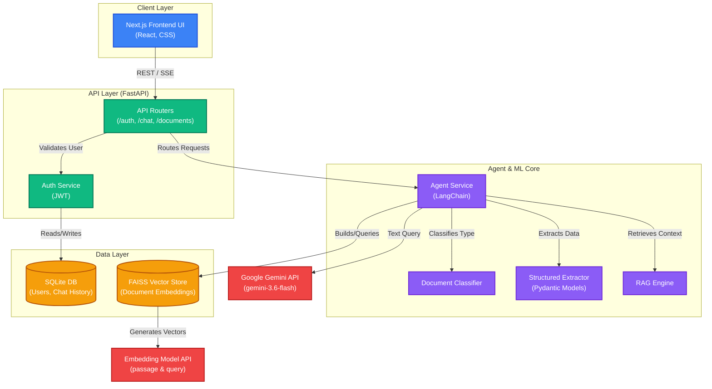

# AI Loan Approval System Architecture

This document provides a high-level overview of the system architecture for the AI Loan Approval Agent.

## System Components

## Description

1. **Frontend**: A modern Next.js application providing a chat interface, document upload capabilities, and a dashboard for viewing structured loan evaluations.
2. **Backend**: A Python FastAPI server that handles routing, authentication (JWT), and streaming Server-Sent Events (SSE) back to the client.
3. **Agent Service**: Powered by LangChain, this service manages the core logic:
   - **Document Classification**: Determines if uploaded files are Bank Policies, Loan Applications, or Irrelevant.
   - **Structured Extraction**: Uses Pydantic models to enforce structured JSON output from the LLM.
   - **RAG Engine**: Chunks documents and uses FAISS to retrieve relevant context for answering questions.
4. **Data Layer**: Local SQLite database for persistent user accounts and chat history, and an in-memory FAISS vector store for semantic document search.
5. **External LLM**: Uses Google's Gemini models for intelligent reasoning, text generation, and embeddings.
